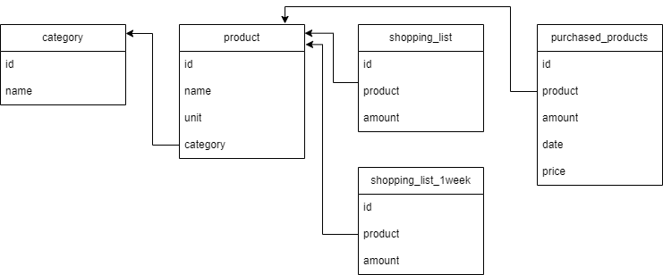

# Программа для составления списка покупок
Используется база данных в postgresql, название базы *products_db*

_Комментарий: мне показалось что самая удобный интерфейс для этого функционала это телеграм бот, он спрашивает есть ли продукт, нажимаешь кнопочки, формируется список. Не все функции реализованы, _

### Таблицы в БД
- Категории
- Товары
- Список покупок
- Список товаров на неделю
- Купленные товары

### Функции:
- вывод категорий продуктов
- вывод всех продуктов
- вывод списка покупок на неделю
- вывод текущего списка покупок
- вывод списка купленных товаров

* добавление, удаление, изменение категории
* добавление, удаление, изменение товара
* добавление, удадение, изменение товара в список товаров на неделю
* добавление товара в купленные товары
* формирование списка покупок (добавление еженедельного списка плюс предложение добавить что то)
* чек ап недельного списка
* чек ап полного списка
* чек ап по категориям
* _чек ап для конкретного магазина
* перенос списка покупок в купленные товары

### ещё сделать
- добавить для товара параметр shops, в котором будет список магазинов, чтобы можно было делать чекап для конкретного магазина
- для внесеня товара в список покупок сначала искать в Product по наименованию
- параметры для формирования DNS брать из файла, сделать БД на выбор
- при добавлении товаров, уже существующих в списках, менять количество, а не создавать новые
- корректировка списка товаров на неделю по результатам анализа купленных товаров по истечение какого-то срока
- добавить возможность вносить товары в список покупок "на будущее", для этого добавить еще таблицу в бд