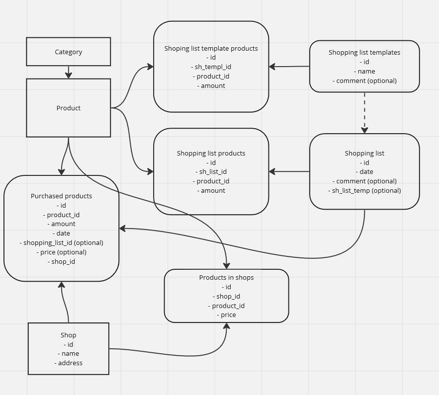
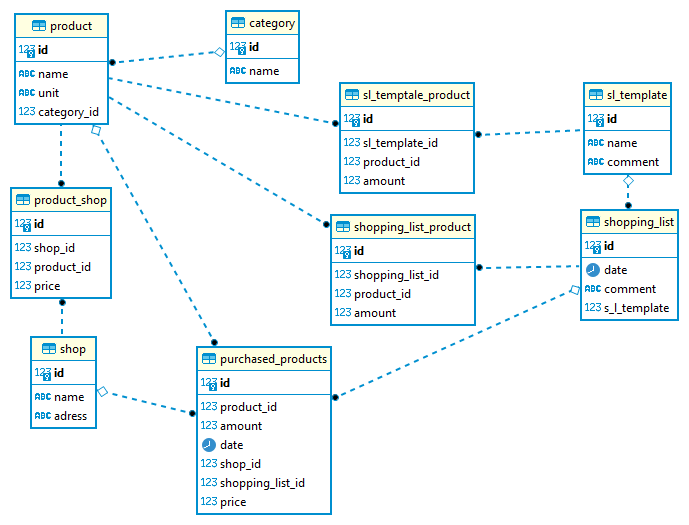

# Программа для составления списка покупок
Используется база данных в postgresql, название базы *products_db*

_Комментарий: мне показалось что самая удобный интерфейс для этого функционала это телеграм бот, он спрашивает есть ли продукт, нажимаешь кнопочки, формируется список. Не все функции реализованы, _

### Таблицы в БД
- Категории
- Товары
- Список покупок
- Список товаров на неделю
- Купленные товары

### Функции:
- вывод категорий продуктов _(category_list)_
- вывод всех продуктов _(product_list)_ 
<!-- - вывод списка покупок на неделю _(shopping_list_week_view)_
- вывод текущего списка покупок _(shopping_list_view)_
- вывод списка купленных  _(purchased_product_list)_

* добавление (удаление, изменение) категории _(add_category)_
* добавление (удаление, изменение) товара _(add_product)_
* добавление, удадение, изменение товара в список товаров на неделю _(add_shopping_list_week, del_shopping_list_week, update_shopping_list_week)_
* добавление товара в купленные товары (сделать апдейт функций для списка на неделю??)
* формирование списка покупок (добавление еженедельного списка плюс предложение добавить что то) _(create_shopping_list)_
* очистка списка покупок _(clear_shopping_list)_
* чек ап недельного списка _(check_shopping_list_week)_
* чек ап полного списка _(check_products)_
* чек ап по категориям _(check_category)_
* _чек ап для конкретного магазина
* перенос списка покупок в купленные товары _(shopping_list_done)_ -->
 - создание категории
 - создание товара
 - создание магазина
 - создание записи в таблице товар-магазин?? 
 - создание шаблона списка покупок
 - внесение товара в шаблон
 <!-- - удаление продуктат из шаблона -->
 <!-- - корректирование записи в шаблоне -->
 - создание списка покупок
 - внесение товара в список покупок
 - внесение товара в список купленных товаров

### ещё сделать
- для внесеня товара в список покупок сначала искать в Product по наименованию
- параметры для формирования DNS брать из файла, сделать БД на выбор
- при добавлении товаров, уже существующих в списках, менять количество, а не создавать новые
- корректировка списка товаров на неделю по результатам анализа купленных товаров по истечение какого-то срока
- добавить возможность вносить товары в список покупок "на будущее", для этого добавить еще таблицу в бд
- придумать когда лучше очищать список покупок, пока это делается в начале некоторых функций, нужно чтотбы можно было создавать общий список по нескольким критериям
- в функции del_shopping_list_week добавить предупреждение в случае, если id для удаления был введен неверно

### Вопросы к 4.08
* удаления продуктов и категорий быть не может, потому что полетят связи
* если при заполнении таблиц (функция _db_filling_) явно задать id, то в дальнейшем при создании экземпляра класса ему будет присваиваться уже существующий id, почему так?
* унифицировать функции crud для списков товаров имеет смысл, если они имеют отличающиеся поля(в купленных товарах есть поле дата)

### консультация 4.08
- комплексние ключи имя + unit составной ключ
- autoincrement
- Выполнить запросы в бд:
    * все продукты за определенную дату, которые не попали ни в один список покупок
    * все продукты со пн по пт вне списка покупок
    * список продуктов из отпределенного списка
    * в какой магазин пойти чтобы купить все из списка покупок

### Вопросы к 21.08
- Общее:
    - план проекта
    - тестовые данные (как лучше заполнять бд, как выбрать количество данных)
    - правила оформления кода, именование переменных
    - вопросы когда и как задавать
    - комментарии к работе в каком виде должны быть
- По проекту:
    - миграции (alembic)
    - в таблице shopping_list поле sh_list_temp подумать для чего оно применяется
    - при изменениях в шаблоне, нужно ли создавать новый шаблон, если сохранять все, тогда можно ввести полe vallid булевое, а имя сделать не уникальным, тогда при изменении шаблона будет создаваться новый, с другим id, а старому присваиваться valid = false, то же самое с текущим списком покупок, либо выбирать список с последней датой, либо отмечать что покупки по списку выполнены после переноса товаров в купленные
    - избавться от повторений (в таблице product_shop, например)
    - в купленных товарах поле shopping list как заполняется и есть ли связь, что будет если количество отличается
    - имеет ли смысл создавать отдлтьную функцию для создания экземпляра класса

выбор библиотек

### Консультация 23.08

##Задание:
описать все функции с комментариями для работы приложения через терминал
пробую на этот раз сначала выполнить задание по проекту, в оставшееся время курс по js
контролировать на что и сколько времени уходит

### Вопросы к 6.09

alembic не отражается изменение типа данных
выяснить как сделать так, чтобы при применении миграции, в которой удалаются элементы бд, содержащие информацию, была какая-то доп проверка на удвление или хотя бы сообщение о том что данные есть, если такое возможно

нужно везде прописатьобработку исключениий или условие для вводимых данных

откатить назад изменения в бд, в самих данных, почитать про резервное копирование

строка 74 коммит во вложенном добавлении категории. можно query запросом достать число записей, что лучше?  
лучше один коммит в конце чтоб ничего не сохранялось при ошибке

имя магазина может быть не уникально если это сетевой магазин

где хранятся id для экземпляров классов

если параметр необязательный, то он должен быть строковый?

как сделать без доп коммитов, если нужно вносить новую категорию например? удалять закоммиченные данные в случае ошибки это решение или есть лучше?

одинаковое название переменных внутри функции и в месте, где она применяется это ок?(добавить пример из кода)

нет проверок при вводе категории или магазина, если вводить не 0, то д б ошибка, то есть надо отправлять запрос в базу еще раз?

доп функционал: вводить новый магазин и выбирать товары которые в нем есть

нужно ли выкладывать файлы миграции?

вывод "что то куда то добавлено" правильно было бы делать посде коммита

исправить в названиях функций add на create, где это нужно 

